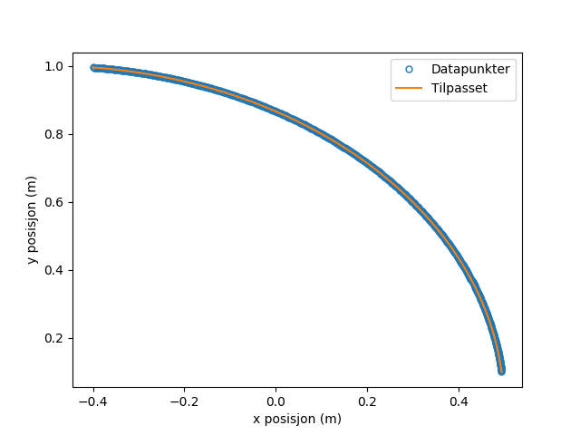
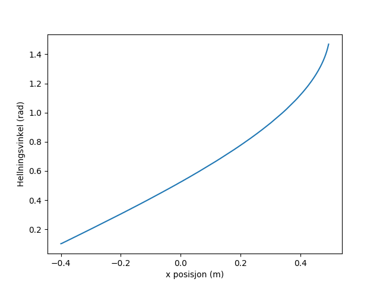
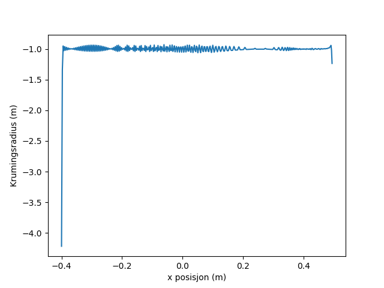
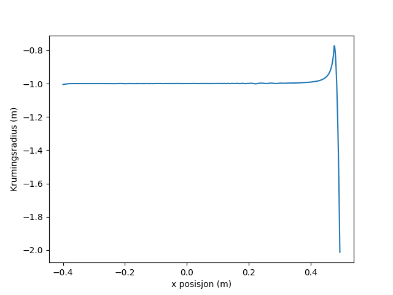

Lane klassen
===============

.. autoclass:: eksternlab.Lane
    :members:

Eksempel
========
La oss si at vi har en tekstfil :download:`bane.txt <_static/bane.txt>` som inneholder en beskrivelse av banen. 
Det er en kolonne med tidspunkter, en med *x*-koordinater og en med
*y*-koordinater.

.. code-block:: python

   # Time (s)  x (m)   y (m)
   0.1 0.0 0.0
   0.2 0.1 -0.05
   0.3 0.15 -0.1
   0.4 0.2 -0.12

En slik kan for eksempel eksporteres fra *Tracker*. Først, leser vi inn fila
ved hjelp av Numpy.

>>> import numpy as np
>>> data = np.loadtxt('source/_static/bane.txt')
>>> x = data[:, 1]
>>> y = data[:, 2]

De to siste linjene henter ut kolonne 1 og 2 av data-arrayet. For å kunne analysere baneprofilen,
benytter vi *Lane*-klassen.

>>> from eksternlab import Lane
>>> lane = Lane(x, y)

La oss først se på hvordan baneprofilen ser ut.

>>> from matplotlib import pyplot as plt
>>> fig = plt.figure()
>>> ax = fig.add_subplot(1, 1, 1)
>>> ax.plot(x, y, 'o', mfc='none', label='Datapunkter', markersize=5)
>>> height = lane.height()
>>> ax.plot(x, height(x), label='Tilpasset')
>>> ax.set_xlabel('x posisjon (m)')
>>> ax.set_ylabel('y posisjon (m)')
>>> ax.legend()
>>> plt.savefig('baneprofil.png')

Baneprofilen vil ser da ut som dette

De blå sirklene er datapunktene fra fila, mens den oransje linja er den tilpassede
funksjonen. Videre kan vi nå se på hellningsvinkelen

>>> alpha = lane.slope()
>>> fig = plt.figure()
>>> ax = fig.add_subplot(1, 1, 1)
>>> ax.plot(x, alpha(x))
>>> ax.set_xlabel('x posisjon (m)')
>>> ax.set_ylabel('Hellningsvinkel (rad)')
>>> plt.savefig('hellningsvinkel.png')

Vi ser at i starten er hellningsvinkelen øker med *x*, i samsvar med baneprofilen 
i figuren over. Til slutt er vi interessert i krumingsradiusen til banen. Denne kan 
vi finne på en lignende måte

>>> radius = lane.radius_of_curvature()
>>> fig = plt.figure()
>>> ax = fig.add_subplot(1, 1, 1)
>>> ax.plot(x, radius(x))
>>> ax.set_xlabel('x posisjon (m)')
>>> ax.set_ylabel('Krumingsradius (m)')
>>> plt.savefig('radius.png')

Vi ser at krumingsradiusen er omtrent 1 for all verdier x. Videre ser vi 
at denne figuren viser et viktig poeng når vi jobber med eksperimentelle data.
Først, ser vi at vi får noen voldsomme utslag på kantene. Dette skyldes at den numeriske
beregningen av de deriverte er unøyaktig på kantene. **Det kan derfor lønne seg å ha 
målinger av banen et godt stykke utenfor område man er primært interessert i**. Det andre
er at kurven er vesentlig mer hakkete enn kurvene for posisjonen og hellningsvinkelen. Hovedgrunnen
til dette er at radiusen avhenger of den dobbeltderiverte av høyden. En generell regel er at desto høyere
deriverte man beregner, desto mer sensitive er resultatet til støy. Alle funksjonene i *Lane*-klassen (*height*, *slope* og *radius_of_curvature*),
har derfor et argument *smooth*. Dette brukes til å glatte ut støy, ved å øke dette argumentet vil vi benytte oss av gjennomsnitt
over flere punkter når vi beregner deriverte. Dersom du ikke spesifiserer dette argumentet, tar det verdien 5.

La oss prøve å beregne krumningsradiusen ved å øke dette tallet til f.eks. 21. 
**Merk at smooth argumentet må være et oddetall**.

>>> radius = lane.radius_of_curvature(smooth=21)
>>> fig = plt.figure()
>>> ax = fig.add_subplot(1, 1, 1)
>>> ax.plot(x, radius(x))
>>> ax.set_xlabel('x posisjon (m)')
>>> ax.set_ylabel('Krumingsradius (m)')
>>> plt.savefig('radius_smooth.png')

Som vi ser får vi nå en mye glattere kurve. Merk at probleme på kanten av datasettet er fortsatt til stedet.